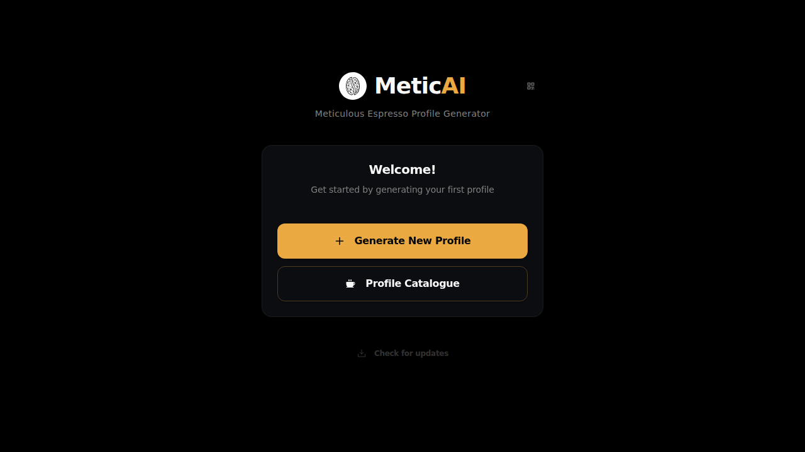
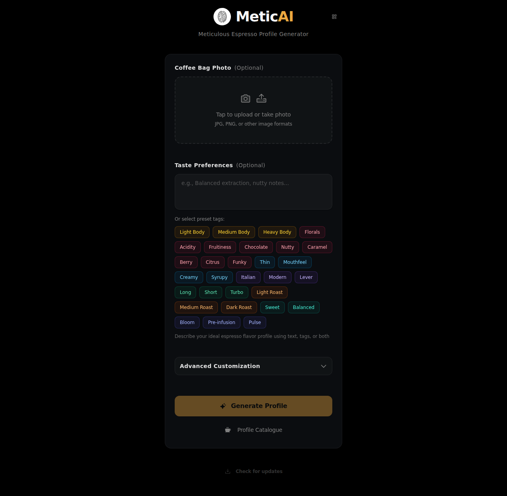
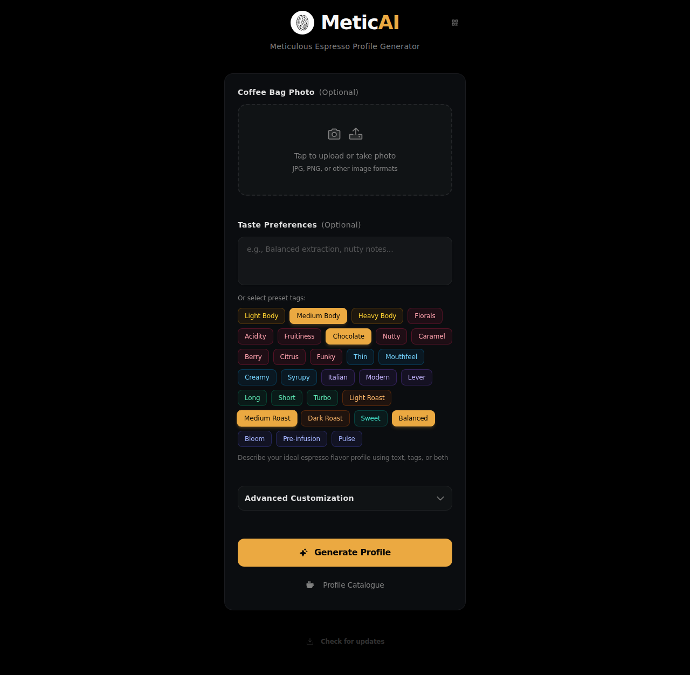
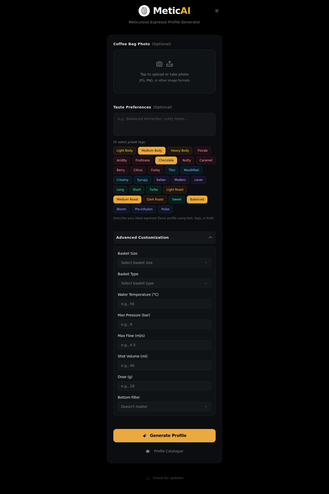
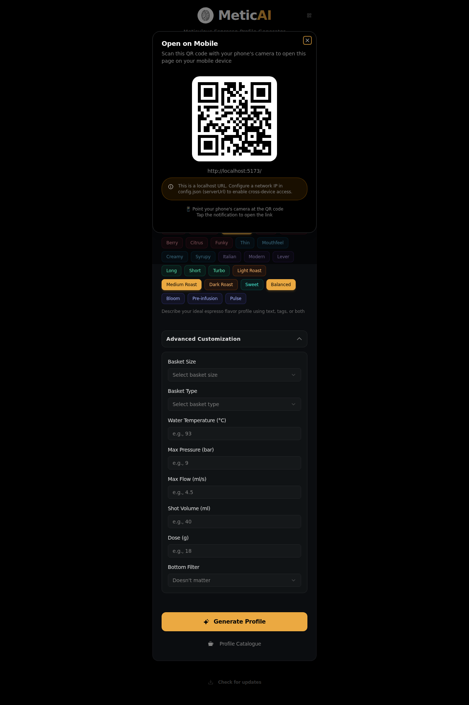
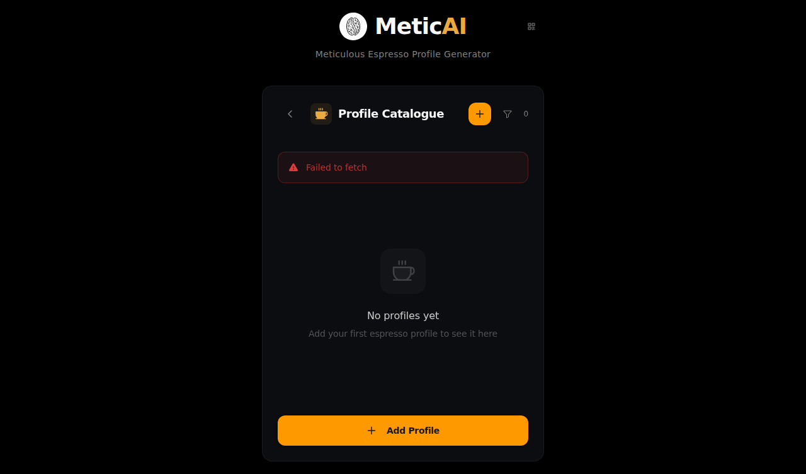

# MeticAI Web Application - Visual Documentation

This document provides a comprehensive visual overview of the MeticAI web application, showcasing all major features, user interface components, and workflows.

## Table of Contents

- [Overview](#overview)
- [Main Features](#main-features)
  - [Welcome Screen](#welcome-screen)
  - [Profile Generation Form](#profile-generation-form)
  - [Taste Preferences & Tags](#taste-preferences--tags)
  - [Advanced Customization](#advanced-customization)
  - [Mobile Access (QR Code)](#mobile-access-qr-code)
  - [Profile Catalogue](#profile-catalogue)
- [Branding Assets](#branding-assets)
- [Key Features Summary](#key-features-summary)

---

## Overview

MeticAI is an AI-powered espresso profile generator that helps coffee enthusiasts create customized espresso extraction profiles based on coffee bag images and taste preferences. The application features a modern, dark-themed interface with intuitive controls and comprehensive customization options.

**Technology Stack:**
- React 19
- TypeScript
- Tailwind CSS
- Radix UI Components
- Framer Motion for animations
- Phosphor Icons

---

## Main Features

### Welcome Screen

**Description:** The application's landing page greets users with a clean, welcoming interface featuring:
- MeticAI logo and branding
- Tagline: "Meticulous Espresso Profile Generator"
- Two primary action buttons:
  - **Generate New Profile** - Creates a new espresso profile
  - **Profile Catalogue** - Browse saved profiles
- Mobile access button (QR code icon in header)
- Check for updates button

**Use Case:** First-time users are immediately presented with clear options to either start generating a profile or explore existing profiles.

---

### Profile Generation Form

**Description:** The main profile generation interface includes:
- **Coffee Bag Photo Upload** (Optional)
  - Drag-and-drop or tap to upload
  - Supports JPG, PNG, and other image formats
  - Camera and upload icons for visual clarity
- **Taste Preferences** section with:
  - Free-form text input for custom descriptions
  - 30+ preset flavor and style tags organized by category
- **Generate Profile** button (enabled when preferences are provided)
- **Profile Catalogue** button for quick access to saved profiles

**Use Case:** Users can describe their ideal espresso profile through text, visual cues (coffee bag photo), or preset tags.

---

### Taste Preferences & Tags

**Description:** Interactive tag selection system featuring:
- **Body Tags:** Light Body, Medium Body, Heavy Body
- **Flavor Tags:** Florals, Acidity, Fruitiness, Chocolate, Nutty, Caramel, Berry, Citrus, Funky
- **Mouthfeel Tags:** Thin, Mouthfeel, Creamy, Syrupy
- **Style Tags:** Italian, Modern, Lever
- **Shot Type Tags:** Long, Short, Turbo
- **Roast Level Tags:** Light Roast, Medium Roast, Dark Roast
- **Profile Tags:** Sweet, Balanced, Bloom, Pre-infusion, Pulse

**Visual Design:**
- Color-coded tags by category (yellow/orange for body, pink/red for flavors, blue/teal for style, etc.)
- Active/selected state with highlighted styling
- Tags can be combined for nuanced profile customization

**Use Case:** Users can quickly select multiple tags to describe their preferences, making profile generation faster and more intuitive than typing descriptions.

---

### Advanced Customization

**Description:** Expandable advanced options panel providing granular control over extraction parameters:

**Equipment Settings:**
- **Basket Size** - Dropdown selection
- **Basket Type** - Dropdown selection
- **Bottom Filter** - Optional filter preference

**Extraction Parameters:**
- **Water Temperature (°C)** - Numeric input with spinner
- **Max Pressure (bar)** - Precise pressure control
- **Max Flow (ml/s)** - Flow rate specification
- **Shot Volume (ml)** - Target output volume
- **Dose (g)** - Coffee dose in grams

**Visual Design:**
- Collapsible panel to keep interface clean
- Clear labels and input fields
- Placeholder values showing typical ranges

**Use Case:** Advanced users can specify exact parameters for their espresso machine setup, ensuring profiles are tailored to their specific equipment.

---

### Mobile Access (QR Code)

**Description:** Mobile accessibility feature enabling cross-device access:
- QR code for instant mobile access
- Current URL display
- Clear instructions for scanning with phone camera
- Warning for localhost URLs with guidance for network configuration
- Responsive dialog design

**Use Case:** Desktop users can quickly transfer their session to mobile devices, useful for taking the profile to the espresso machine without a desktop/laptop.

---

### Profile Catalogue

**Description:** Profile management and browsing interface:
- **Header** with:
  - Back navigation button
  - Coffee cup icon branding
  - "Profile Catalogue" title
  - Add Profile button (+ icon)
  - Filter by tags button
  - Profile count indicator
- **Empty State** showing:
  - Coffee cup illustration
  - "No profiles yet" message
  - Helpful call-to-action to add first profile

**Future State (with profiles):**
- Grid/list view of saved profiles
- Filter and search capabilities
- Tag-based filtering
- Profile preview cards with key details

**Use Case:** Users can manage their collection of espresso profiles, making it easy to find and reuse successful extraction recipes.

---

## Branding Assets

### Logo

The MeticAI logo features a stylized coffee bean design with "AI" highlighted in orange/gold, representing the fusion of coffee craftsmanship and artificial intelligence.

**Available Formats:**
- `logo.svg` - Vector format (scalable)
- `logo.png` - Raster format
- `logo-white.svg` - White version for dark backgrounds

### Color Scheme

**Primary Colors:**
- **Gold/Orange** (#F59E0B range) - Call-to-action buttons, active states, highlights
- **Dark Background** (#0A0A0A, #1A1A1A) - Main background
- **Gray Text** (#A0A0A0) - Secondary text
- **White** (#FFFFFF) - Primary text and icons

**Tag Categories (Color-Coded):**
- **Yellow/Orange** - Body characteristics
- **Pink/Red** - Flavor notes
- **Blue/Teal** - Style and technical
- **Green** - Extraction techniques

---

## Key Features Summary

### User Interface Highlights

1. **Modern Dark Theme**
   - Sleek, professional appearance
   - Reduces eye strain
   - Emphasizes content and actions

2. **Intuitive Navigation**
   - Clear hierarchy of information
   - Consistent button placement
   - Logical workflow progression

3. **Responsive Design**
   - Works on desktop and mobile devices
   - Touch-friendly interface elements
   - QR code for easy device switching

4. **Visual Feedback**
   - Active states for selected tags
   - Hover effects on interactive elements
   - Smooth animations and transitions

### Functional Highlights

1. **Flexible Input Methods**
   - Text descriptions
   - Image upload (coffee bag recognition)
   - Preset tag selection
   - Advanced parameter inputs

2. **AI-Powered Generation**
   - Analyzes coffee bag images
   - Interprets taste preferences
   - Generates customized espresso profiles

3. **Profile Management**
   - Save and organize profiles
   - Tag-based filtering
   - Easy access to profile catalogue

4. **Advanced Customization**
   - Equipment-specific settings
   - Precise extraction parameters
   - Professional-grade control

5. **Accessibility**
   - Mobile QR code access
   - Clear labels and descriptions
   - Logical tab order and keyboard navigation

---

## Screenshot Organization

All screenshots are organized in the `resources/screenshots/` directory with descriptive filenames:

- `01-welcome-screen.png` - Initial landing page
- `02-upload-form-empty.png` - Profile generation form (empty state)
- `03-form-with-tags-selected.png` - Form with multiple tags selected
- `04-advanced-customization.png` - Advanced options expanded
- `05-qr-code-dialog.png` - Mobile access QR code
- `06-profile-catalogue-empty.png` - Profile catalogue (empty state)

---

## Marketing Use Cases

### Website Updates

These screenshots are ideal for:
- **Homepage hero section** - Welcome screen showcases clean design
- **Features page** - Individual screenshots highlight specific capabilities
- **How it works section** - Step-by-step visual guide using form screenshots
- **Mobile features** - QR code dialog demonstrates cross-device functionality

### Promotional Materials

- **Social media posts** - Tag selection interface shows unique value proposition
- **Blog articles** - Screenshots illustrate advanced features and customization
- **Documentation** - Visual guides for user onboarding
- **Presentations** - Professional screenshots for demos and pitches

### App Store / Repository

- **README.md enhancement** - Visual showcase of application features
- **GitHub repository** - Screenshots in documentation and wiki
- **Release notes** - Feature announcements with visuals

---

## Additional Notes

### Design Principles Demonstrated

1. **Progressive Disclosure** - Advanced options hidden until needed
2. **Visual Hierarchy** - Clear distinction between primary and secondary actions
3. **Consistency** - Uniform styling across all components
4. **Accessibility** - High contrast, clear labels, keyboard navigation support
5. **User Feedback** - Visual states for all interactive elements

### Technical Implementation Highlights

- **Component-based architecture** using React 19
- **Type-safe** with TypeScript
- **Utility-first styling** with Tailwind CSS
- **Accessible components** from Radix UI
- **Smooth animations** powered by Framer Motion
- **Icon system** using Phosphor Icons

---

*Last Updated: January 25, 2026*
*MeticAI Web Application v0.0.0*
