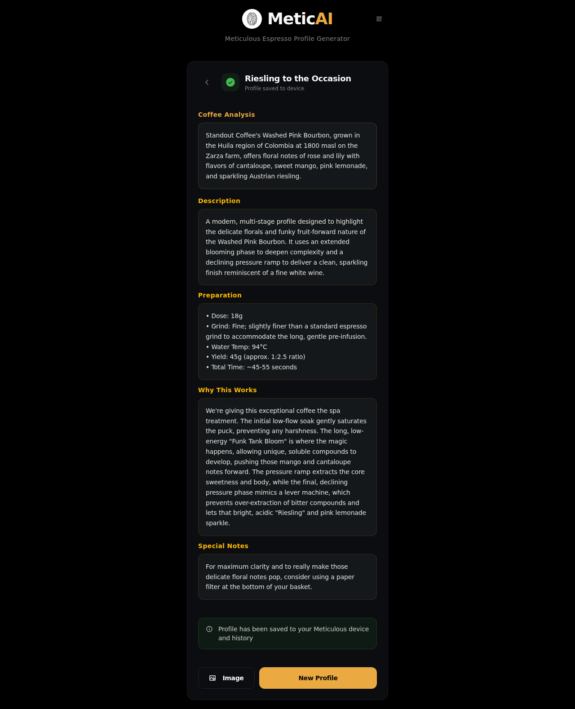
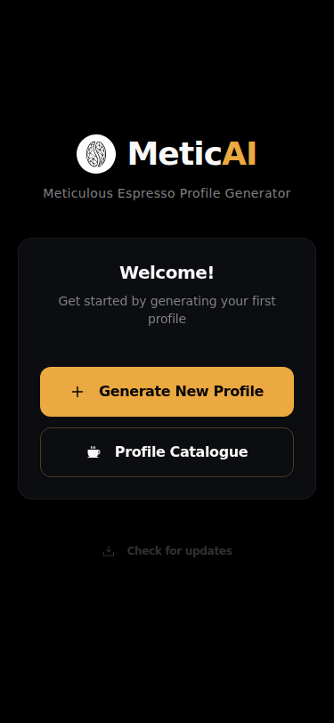
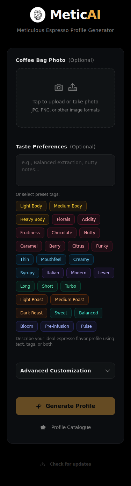
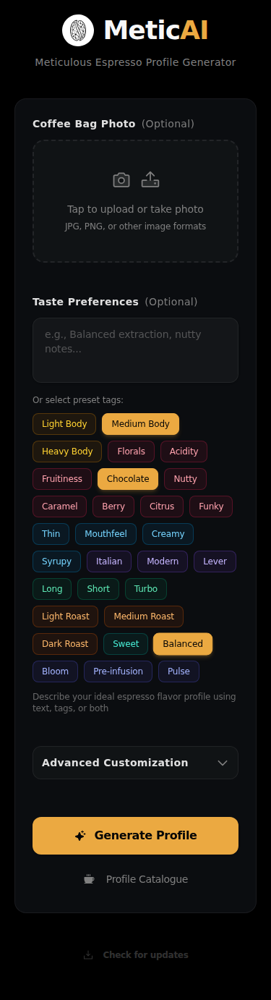
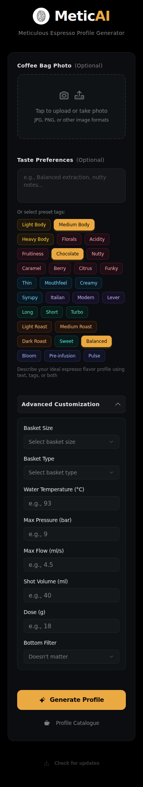
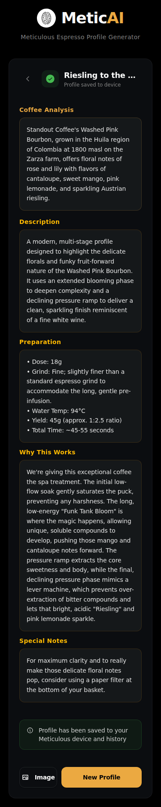
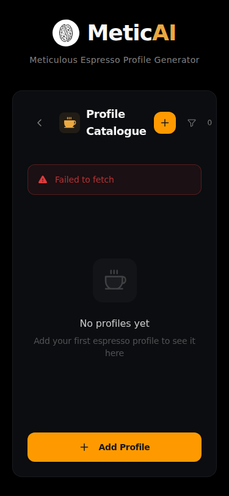

# MeticAI Web Application - Visual Documentation

This document provides a comprehensive visual overview of the MeticAI web application, showcasing all major features, user interface components, and workflows.

## Table of Contents

- [Overview](#overview)
- [Main Features](#main-features)
  - [Welcome Screen](#welcome-screen)
  - [Profile Generation Form](#profile-generation-form)
  - [Taste Preferences & Tags](#taste-preferences--tags)
  - [Advanced Customization](#advanced-customization)
  - [Mobile Access (QR Code)](#mobile-access-qr-code)
  - [Profile Catalogue](#profile-catalogue)
- [Branding Assets](#branding-assets)
- [Key Features Summary](#key-features-summary)

---

## Overview

MeticAI is an AI-powered espresso profile generator that helps coffee enthusiasts create customized espresso extraction profiles based on coffee bag images and taste preferences. The application features a modern, dark-themed interface with intuitive controls and comprehensive customization options.

**Technology Stack:**
- React 19
- TypeScript
- Tailwind CSS
- Radix UI Components
- Framer Motion for animations
- Phosphor Icons

---

## Main Features

### Welcome Screen

**Description:** The application's landing page greets users with a clean, welcoming interface featuring:
- MeticAI logo and branding
- Tagline: "Meticulous Espresso Profile Generator"
- Two primary action buttons:
  - **Generate New Profile** - Creates a new espresso profile
  - **Profile Catalogue** - Browse saved profiles
- Mobile access button (QR code icon in header)
- Check for updates button

**Use Case:** First-time users are immediately presented with clear options to either start generating a profile or explore existing profiles.

---

### Profile Generation Form

**Description:** The main profile generation interface includes:
- **Coffee Bag Photo Upload** (Optional)
  - Drag-and-drop or tap to upload
  - Supports JPG, PNG, and other image formats
  - Camera and upload icons for visual clarity
- **Taste Preferences** section with:
  - Free-form text input for custom descriptions
  - 30+ preset flavor and style tags organized by category
- **Generate Profile** button (enabled when preferences are provided)
- **Profile Catalogue** button for quick access to saved profiles

**Use Case:** Users can describe their ideal espresso profile through text, visual cues (coffee bag photo), or preset tags.

---

### Taste Preferences & Tags

**Description:** Interactive tag selection system featuring:
- **Body Tags:** Light Body, Medium Body, Heavy Body
- **Flavor Tags:** Florals, Acidity, Fruitiness, Chocolate, Nutty, Caramel, Berry, Citrus, Funky
- **Mouthfeel Tags:** Thin, Mouthfeel, Creamy, Syrupy
- **Style Tags:** Italian, Modern, Lever
- **Shot Type Tags:** Long, Short, Turbo
- **Roast Level Tags:** Light Roast, Medium Roast, Dark Roast
- **Profile Tags:** Sweet, Balanced, Bloom, Pre-infusion, Pulse

**Visual Design:**
- Color-coded tags by category (yellow/orange for body, pink/red for flavors, blue/teal for style, etc.)
- Active/selected state with highlighted styling
- Tags can be combined for nuanced profile customization

**Use Case:** Users can quickly select multiple tags to describe their preferences, making profile generation faster and more intuitive than typing descriptions.

---

### Advanced Customization

**Description:** Expandable advanced options panel providing granular control over extraction parameters:

**Equipment Settings:**
- **Basket Size** - Dropdown selection
- **Basket Type** - Dropdown selection
- **Bottom Filter** - Optional filter preference

**Extraction Parameters:**
- **Water Temperature (°C)** - Numeric input with spinner
- **Max Pressure (bar)** - Precise pressure control
- **Max Flow (ml/s)** - Flow rate specification
- **Shot Volume (ml)** - Target output volume
- **Dose (g)** - Coffee dose in grams

**Visual Design:**
- Collapsible panel to keep interface clean
- Clear labels and input fields
- Placeholder values showing typical ranges

**Use Case:** Advanced users can specify exact parameters for their espresso machine setup, ensuring profiles are tailored to their specific equipment.

---

### Mobile Access (QR Code)

**Description:** Mobile accessibility feature enabling cross-device access:
- QR code for instant mobile access
- Current URL display
- Clear instructions for scanning with phone camera
- Warning for localhost URLs with guidance for network configuration
- Responsive dialog design

**Use Case:** Desktop users can quickly transfer their session to mobile devices, useful for taking the profile to the espresso machine without a desktop/laptop.

---

### Profile Catalogue

**Description:** Profile management and browsing interface:
- **Header** with:
  - Back navigation button
  - Coffee cup icon branding
  - "Profile Catalogue" title
  - Add Profile button (+ icon)
  - Filter by tags button
  - Profile count indicator
- **Empty State** showing:
  - Coffee cup illustration
  - "No profiles yet" message
  - Helpful call-to-action to add first profile

**Future State (with profiles):**
- Grid/list view of saved profiles
- Filter and search capabilities
- Tag-based filtering
- Profile preview cards with key details

**Use Case:** Users can manage their collection of espresso profiles, making it easy to find and reuse successful extraction recipes.

---

### Demo Results View

**Description:** Complete espresso profile results display showing:
- **Profile Header:**
  - "Riesling to the Occasion" profile name
  - "Profile saved to device" confirmation
  - Back to form navigation button
- **Coffee Analysis** section with detailed bean information
- **Description** of the extraction profile and its characteristics
- **Preparation** details including:
  - Dose: 18g
  - Grind specifications
  - Water temperature: 94°C
  - Yield ratio and timing
- **Why This Works** - Technical explanation of the profile design
- **Special Notes** - Additional tips and recommendations
- **Action buttons:**
  - Save as image
  - Create new profile

**Use Case:** Users receive a comprehensive, detailed espresso profile they can save, share, or use as a reference when brewing. The profile includes both technical parameters and practical brewing guidance.

**Note:** This demo view can be accessed by quickly clicking the MeticAI header 5 times, allowing users to see a sample profile without connecting to a backend server.

---

## Mobile Screenshots

The application is fully responsive and optimized for mobile devices. Below are screenshots showcasing the mobile experience:

### Mobile Welcome Screen

**Description:** Mobile-optimized welcome screen featuring:
- Centered MeticAI logo and branding
- Clear call-to-action buttons stacked vertically
- Touch-friendly button sizes
- Optimized spacing for smaller screens
- Note: QR code button is hidden on mobile (not needed when already on mobile)

**Use Case:** Mobile users get immediate access to profile generation or browsing existing profiles with a clean, uncluttered interface.

---

### Mobile Form - Empty State

**Description:** Profile generation form optimized for mobile:
- Stacked vertical layout for better scrolling
- Large, touch-friendly upload area
- Text input with mobile keyboard optimization
- Tag selection with wrap layout
- All tags visible and easily tappable
- Buttons stacked at bottom for thumb access

**Use Case:** Users can comfortably create profiles on mobile devices with all functionality accessible through touch-friendly controls.

---

### Mobile Form - With Tags Selected

**Description:** Mobile form showing selected taste preference tags:
- Selected tags highlighted with distinct styling
- Color-coded categories maintained from desktop
- Easy to select/deselect tags with single tap
- Scrollable tag area for viewing all options
- Generate Profile button becomes enabled when tags are selected

**Use Case:** Mobile users can quickly build their flavor profile using intuitive tag selection optimized for touch interaction.

---

### Mobile Advanced Customization

**Description:** Advanced options panel expanded on mobile:
- Accordion-style expansion preserves screen space
- All equipment and extraction parameters accessible
- Mobile-optimized input controls:
  - Dropdown selectors for basket options
  - Numeric spinners for precise values
  - Touch-friendly increase/decrease buttons
- Vertical stacking of all fields for easy scrolling

**Use Case:** Advanced users on mobile can access the same granular controls as desktop users with an interface optimized for smaller screens.

---

### Mobile Demo Results

**Description:** Full profile results view optimized for mobile:
- Scrollable single-column layout
- All profile information accessible
- Large, readable text optimized for mobile
- Collapsible sections for easy navigation
- Back button and action buttons easily accessible
- Success notification displayed at bottom

**Use Case:** Mobile users receive the complete profile information in a format perfect for viewing on-the-go or at the espresso machine.

---

### Mobile Profile Catalogue

**Description:** Profile management interface on mobile:
- Header with back navigation
- Add and filter buttons accessible
- Profile count display
- Empty state messaging
- Large "Add Profile" button
- Optimized for one-handed operation

**Use Case:** Mobile users can easily manage their profile collection with touch-optimized controls and clear visual hierarchy.

---

## Branding Assets

### Logo

The MeticAI logo features a stylized coffee bean design with "AI" highlighted in orange/gold, representing the fusion of coffee craftsmanship and artificial intelligence.

**Available Formats:**
- `logo.svg` - Vector format (scalable)
- `logo.png` - Raster format
- `logo-white.svg` - White version for dark backgrounds

### Color Scheme

**Primary Colors:**
- **Gold/Orange** (#F59E0B range) - Call-to-action buttons, active states, highlights
- **Dark Background** (#0A0A0A, #1A1A1A) - Main background
- **Gray Text** (#A0A0A0) - Secondary text
- **White** (#FFFFFF) - Primary text and icons

**Tag Categories (Color-Coded):**
- **Yellow/Orange** - Body characteristics
- **Pink/Red** - Flavor notes
- **Blue/Teal** - Style and technical
- **Green** - Extraction techniques

---

## Key Features Summary

### User Interface Highlights

1. **Modern Dark Theme**
   - Sleek, professional appearance
   - Reduces eye strain
   - Emphasizes content and actions

2. **Intuitive Navigation**
   - Clear hierarchy of information
   - Consistent button placement
   - Logical workflow progression

3. **Responsive Design**
   - Works on desktop and mobile devices
   - Touch-friendly interface elements
   - QR code for easy device switching

4. **Visual Feedback**
   - Active states for selected tags
   - Hover effects on interactive elements
   - Smooth animations and transitions

### Functional Highlights

1. **Flexible Input Methods**
   - Text descriptions
   - Image upload (coffee bag recognition)
   - Preset tag selection
   - Advanced parameter inputs

2. **AI-Powered Generation**
   - Analyzes coffee bag images
   - Interprets taste preferences
   - Generates customized espresso profiles

3. **Profile Management**
   - Save and organize profiles
   - Tag-based filtering
   - Easy access to profile catalogue

4. **Advanced Customization**
   - Equipment-specific settings
   - Precise extraction parameters
   - Professional-grade control

5. **Accessibility**
   - Mobile QR code access
   - Clear labels and descriptions
   - Logical tab order and keyboard navigation

---

## Screenshot Organization

All screenshots are organized in the `resources/screenshots/` directory with descriptive filenames:

**Desktop Screenshots:**
- `01-welcome-screen.png` - Initial landing page
- `02-upload-form-empty.png` - Profile generation form (empty state)
- `03-form-with-tags-selected.png` - Form with multiple tags selected
- `04-advanced-customization.png` - Advanced options expanded
- `05-qr-code-dialog.png` - Mobile access QR code
- `06-profile-catalogue-empty.png` - Profile catalogue (empty state)
- `07-demo-results-desktop.png` - Complete profile results view

**Mobile Screenshots (375x812 viewport):**
- `mobile-01-welcome-screen.png` - Mobile welcome/start screen
- `mobile-02-form-empty.png` - Mobile profile generation form (empty)
- `mobile-03-form-with-tags.png` - Mobile form with tags selected
- `mobile-04-advanced-customization.png` - Mobile advanced options expanded
- `mobile-05-demo-results.png` - Mobile profile results view
- `mobile-06-profile-catalogue.png` - Mobile profile catalogue

---

## Marketing Use Cases

### Website Updates

These screenshots are ideal for:
- **Homepage hero section** - Welcome screen showcases clean design (desktop and mobile)
- **Features page** - Individual screenshots highlight specific capabilities
- **How it works section** - Step-by-step visual guide using form screenshots
- **Mobile features** - Mobile screenshots demonstrate responsive design and cross-device functionality
- **Demo section** - Results view shows the value proposition

### Promotional Materials

- **Social media posts** - Tag selection interface shows unique value proposition; mobile screenshots demonstrate responsive design
- **Blog articles** - Screenshots illustrate advanced features and customization on both desktop and mobile
- **Documentation** - Visual guides for user onboarding with platform-specific examples
- **Presentations** - Professional screenshots for demos and pitches showcasing cross-platform support
- **Mobile app stores** - Mobile screenshots ready for app store listings (if PWA is published)

### App Store / Repository

- **README.md enhancement** - Visual showcase of application features
- **GitHub repository** - Screenshots in documentation and wiki
- **Release notes** - Feature announcements with visuals

---

## Additional Notes

### Design Principles Demonstrated

1. **Progressive Disclosure** - Advanced options hidden until needed
2. **Visual Hierarchy** - Clear distinction between primary and secondary actions
3. **Consistency** - Uniform styling across all components
4. **Accessibility** - High contrast, clear labels, keyboard navigation support
5. **User Feedback** - Visual states for all interactive elements

### Technical Implementation Highlights

- **Component-based architecture** using React 19
- **Type-safe** with TypeScript
- **Utility-first styling** with Tailwind CSS
- **Accessible components** from Radix UI
- **Smooth animations** powered by Framer Motion
- **Icon system** using Phosphor Icons

---

*Last Updated: January 25, 2026*
*MeticAI Web Application v0.0.0*
